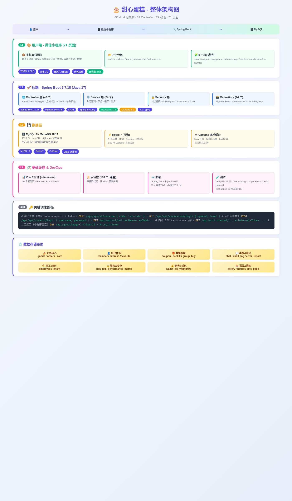
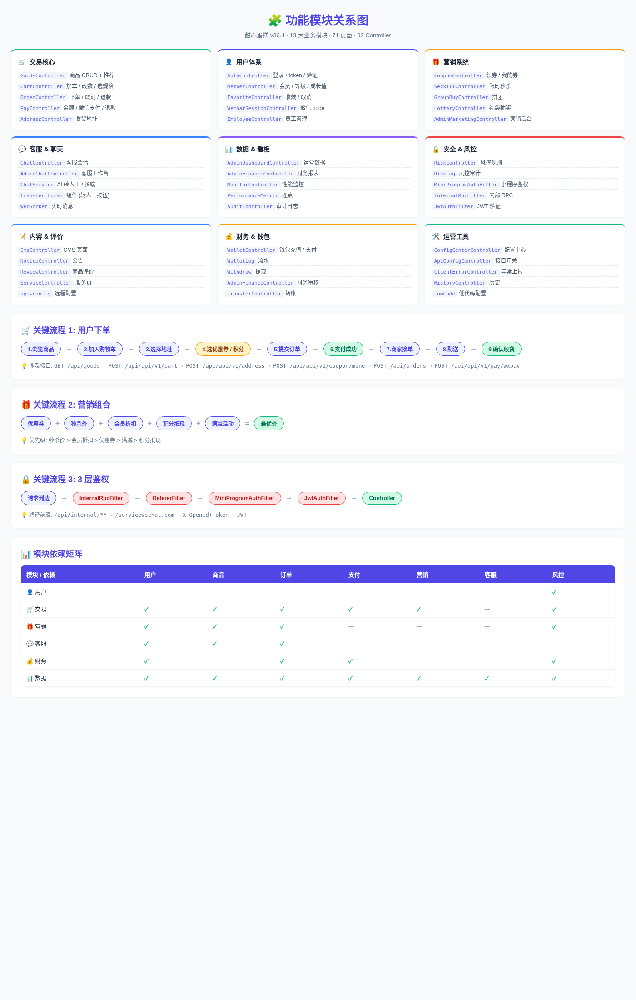
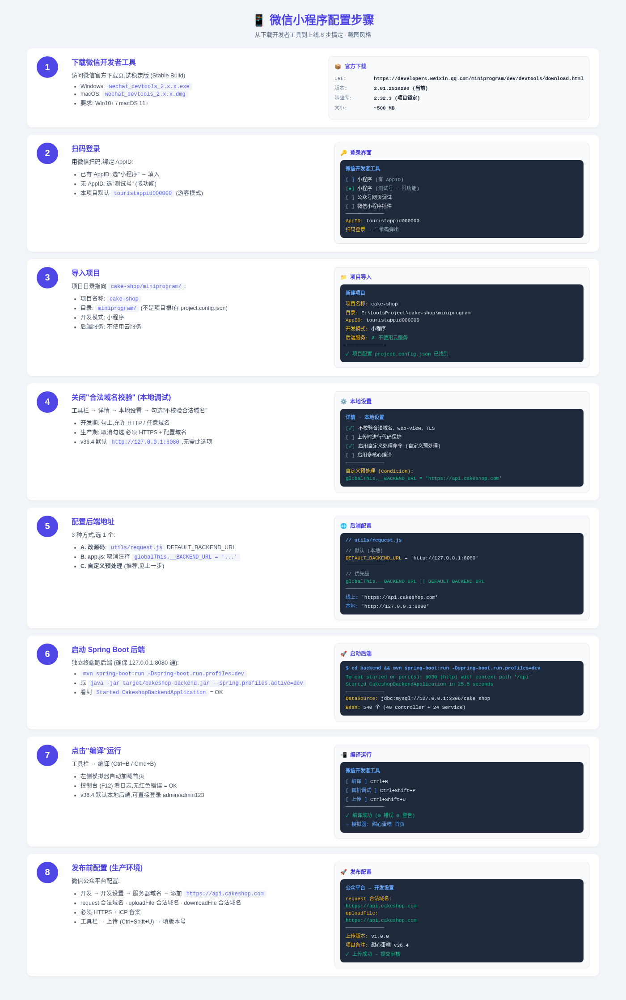

# 🍰 甜心蛋糕 - 完整操作手册

> v36.4 · 全栈电商小程序 · Spring Boot + 微信小程序 + Vue 后台
> 本文档涵盖: 功能架构、实现原理、模块关联、配置步骤

---

## 📑 目录

1. [项目概览](#1-项目概览)
2. [整体架构](#2-整体架构)
3. [功能模块与关联性](#3-功能模块与关联性)
4. [实现原理](#4-实现原理)
5. [微信小程序配置步骤](#5-微信小程序配置步骤)
6. [功能操作手册](#6-功能操作手册)
7. [常见问题](#7-常见问题)

---

## 1. 项目概览

### 1.1 一句话介绍
**甜心蛋糕** 是基于 Spring Boot + 微信小程序的蛋糕销售平台,集电商、会员、营销、客服、风控、财务、内容管理于一体。

### 1.2 规模
| 项目 | 数量 |
|------|------|
| 后端 Controller | 40 个 |
| 后端 Service | 24 个 |
| 数据库表 | 27 张 |
| 小程序页面 | 71 个 |
| 小程序组件 | 5 个 |
| 小程序分包 | 7 个 |
| Vue 后台页面 | 40 个 |
| 云函数 (兼容) | 180 个 |
| **代码总行数** | **~ 50,000** |

### 1.3 核心特性
- ✅ **直连后端** (v34.0 替代云函数中转,响应更快)
- ✅ **3 层鉴权** (InternalRpc + Referer + MiniProgram + JWT)
- ✅ **多营销系统** (优惠券 / 秒杀 / 拼团 / 福袋 / 会员折扣)
- ✅ **完整客服** (WebSocket + AI 转人工)
- ✅ **风控审计** (Risk Log + Audit Log + 异常上报)
- ✅ **离线支持** (tracker 队列 + 离线操作)
- ✅ **多端后台** (Vue 3 + Element Plus + 内部 RPC)

---

## 2. 整体架构



### 2.1 4 层架构

**L1 用户端 (微信小程序, 71 页面)**
- 主包: 9 页面 (首页 / 分类 / 详情 / 购物车 / 订单 / 我的 / 收藏 / 登录 / 搜索)
- 7 个分包: order / address / user / promo / chat / admin / cms
- 5 个核心组件: smart-image / hangup-bar / rich-message / skeleton-card / transfer-human
- 自定义 tabBar (emoji 替代 PNG)

**L2 后端 (Spring Boot 2.7.18 + Java 17)**
- Controller 层 (40 个): REST API + Swagger + 全局异常
- Service 层 (24 个): 业务逻辑 + 事务 + 缓存
- Security 层: 3 层 Filter 鉴权
- Repository 层 (24 个): MyBatis-Plus

**L3 数据层**
- MySQL 8 / MariaDB 10.11: 27 张表,utf8mb4,InnoDB
- Redis 7 (可选): 分布式锁 + 限流 + Session
- Caffeine (本地): 5min TTL,5000 容量

**L4 基础设施**
- Vue 3 后台 (admin-vue)
- 云函数 (180 个,兼容旧逻辑)
- 测试脚本: verify.sh + check-*.sh

### 2.2 关键请求路径

```
# 用户登录 (微信 code → openid + token)
POST /api/api/wx/session          { code: "wx-code" }
GET  /api/api/wx/session/login     { openid, token }

# 后台管理登录
POST /api/api/v1/auth/login       { username, password }
GET  /api/api/v1/notice            Bearer eyJhbGc...

# 内部 RPC (admin-vue 后台)
GET  /api/api/internal/...         X-Internal-Token: ...

# 业务接口 (小程序直连)
GET  /api/goods?page=1            X-Openid + X-Login-Token
```

### 2.3 数据存储布局

| 分类 | 表 |
|------|-----|
| 🍰 业务核心 | goods / orders / cart |
| 👤 用户体系 | member / address / favorite |
| 🎁 营销系统 | coupon / seckill / group_buy |
| 💬 客服&审计 | chat / audit_log / error_report |
| 👨‍💼 员工&租户 | employee / tenant |
| 🔒 鉴权&安全 | risk_log / performance_metric |
| 💰 财务&钱包 | wallet_log / withdraw |
| 🎰 福袋&通知 | lottery / notice / cms_page |

---

## 3. 功能模块与关联性



### 3.1 13 大业务模块

| # | 模块 | 关键 Controller | 关键页面 |
|---|------|----------------|----------|
| 1 | 🛒 交易核心 | GoodsController, CartController, OrderController, PayController | 商品/详情/购物车/订单/支付 |
| 2 | 👤 用户体系 | AuthController, MemberController, WechatSessionController | 登录/我的/会员中心 |
| 3 | 🎁 营销系统 | CouponController, SeckillController, GroupBuyController, LotteryController | 优惠券/秒杀/拼团/福袋 |
| 4 | 💬 客服&聊天 | ChatController, AdminChatController, WebSocket | 客服会话/工作台 |
| 5 | 📊 数据&看板 | AdminDashboardController, AdminFinanceController | 运营报表/财务审核 |
| 6 | 🔒 安全&风控 | RiskController, MiniProgramAuthFilter, InternalRpcFilter | 风控规则/审计日志 |
| 7 | 📝 内容&评价 | CmsController, NoticeController, ReviewController | CMS/公告/评价 |
| 8 | 💰 财务&钱包 | WalletController, AdminFinanceController | 充值/支付/提现 |
| 9 | 🛠️ 运营工具 | ConfigCenterController, ClientErrorController | 配置中心/异常上报 |
| 10 | ⚙️ 系统管理 | AdminGoodsController, AdminOrderController | 后台管理 |
| 11 | 📦 地址&配送 | AddressController | 地址管理 |
| 12 | 🛍️ 商城&店铺 | GoodsController, StoreList | 商品/店铺 |
| 13 | 🔍 搜索&推荐 | SearchController, ApiConfigController | 搜索/个性化 |

### 3.2 关键业务流程

#### 流程 1: 用户下单
```
1.浏览商品 → 2.加入购物车 → 3.选择地址 → 4.选优惠券/积分 → 5.提交订单
   ↓
6.支付成功 → 7.商家接单 → 8.配送 → 9.确认收货
```

涉及接口:
```
GET  /api/goods                     # 浏览
POST /api/api/v1/cart               # 加车
POST /api/api/v1/address            # 地址
POST /api/api/v1/coupon/mine        # 选券
POST /api/orders                    # 下单
POST /api/api/v1/pay/wxpay          # 支付
```

#### 流程 2: 营销组合
```
优惠券 + 秒杀价 + 会员折扣 + 积分抵现 + 满减活动 = 最优价

优先级: 秒杀价 > 会员折扣 > 优惠券 > 满减 > 积分抵现
```

#### 流程 3: 3 层鉴权
```
请求到达
  ↓ InternalRpcFilter     (/api/internal/**)
  ↓ RefererFilter          (servicewechat.com)
  ↓ MiniProgramAuthFilter  (X-Openid + X-Login-Token)
  ↓ JwtAuthFilter          (JWT 验证)
  ↓ Controller
```

### 3.3 模块依赖矩阵

| 模块 \\ 依赖 | 用户 | 商品 | 订单 | 支付 | 营销 | 客服 | 风控 |
|-------------|------|------|------|------|------|------|------|
| 👤 用户      | —    | —    | —    | —    | —    | —    | ✓    |
| 🛒 交易      | ✓    | ✓    | ✓    | ✓    | ✓    | —    | ✓    |
| 🎁 营销      | ✓    | ✓    | ✓    | —    | —    | —    | ✓    |
| 💬 客服      | ✓    | ✓    | ✓    | —    | —    | —    | —    |
| 💰 财务      | ✓    | —    | ✓    | ✓    | —    | —    | ✓    |
| 📊 数据      | ✓    | ✓    | ✓    | ✓    | ✓    | ✓    | ✓    |

---

## 4. 实现原理

### 4.1 鉴权机制 (3 层 Filter)

```java
// 1. InternalRpcFilter - 内部 RPC 隔离
// 路径: /api/internal/**
// 头部: X-Internal-Token: <token>

// 2. MiniProgramRefererFilter - 微信来源验证
// Referer: https://servicewechat.com/{appid}/{version}/page-frame.html

// 3. MiniProgramAuthFilter - 小程序鉴权
// 头部: X-Openid + X-Login-Token
// 验证 Redis 中的 token

// 4. JwtAuthFilter - 后台 JWT
// 头部: Authorization: Bearer <jwt>
```

### 4.2 缓存策略

```java
// 优先级: 本地 (Caffeine) → Redis → DB
@Cacheable(value = "goods", key = "#id", unless = "#result == null")
public Goods getById(Long id) {
    return goodsMapper.selectById(id);
}
```

- **Caffeine**: 5min TTL,5000 容量,本地内存
- **Redis**: 分布式锁 (Redisson) + Session + 限流
- **DB**: MyBatis-Plus 二级缓存

### 4.3 微信 code 换 openid

```java
// MiniProgramSessionService
public Map<String, String> code2Session(String code) {
    // 1. 调微信接口
    String url = "https://api.weixin.qq.com/sns/jscode2session"
               + "?appid=" + appId
               + "&secret=" + secret
               + "&js_code=" + code
               + "&grant_type=authorization_code";
    
    // 2. 解析返回
    JSONObject res = HttpUtil.get(url);
    String openid = res.getString("openid");
    String sessionKey = res.getString("session_key");
    
    // 3. 生成 token + 存 Redis
    String token = UUID.randomUUID().toString();
    redisTemplate.opsForValue().set("mp:token:" + token, openid, 24, HOURS);
    
    return Map.of("openid", openid, "token", token);
}
```

### 4.4 数据校验

- **前端**: WXML 必填项 + `bindblur` 校验
- **后端**: `@Valid` + `@NotNull` / `@NotBlank` / `@Size`
- **Service 层**: 业务规则校验
- **数据库**: `UNIQUE` / `NOT NULL` / 触发器

### 4.5 异常处理

```java
@RestControllerAdvice
public class GlobalExceptionHandler {
    @ExceptionHandler(BizException.class)
    public Result<?> handleBiz(BizException e) {
        return Result.fail(e.getCode(), e.getMessage());
    }
    
    @ExceptionHandler(Exception.class)
    public Result<?> handleAll(Exception e) {
        log.error("unhandled", e);
        return Result.fail(5000, "服务器错误");
    }
}
```

---

## 5. 微信小程序配置步骤



### 5.1 下载开发者工具
访问 https://developers.weixin.qq.com/miniprogram/dev/devtools/download.html
下载稳定版 (2.01.2510290 或更高)

### 5.2 扫码登录
用微信扫码,绑定 AppID:
- 有 AppID: 选"小程序" → 填入
- 无 AppID: 选"测试号" (限功能)
- 本项目默认 `touristappid000000` (游客模式)

### 5.3 导入项目
- 项目目录: `cake-shop/miniprogram/` (含 `project.config.json`)
- 项目名称: `cake-shop`
- 开发模式: **小程序**
- 后端服务: **不使用云服务**

### 5.4 配置后端地址 (3 选 1)

**方式 A: 改源码** (简单粗暴)
```js
// miniprogram/utils/request.js
const DEFAULT_BACKEND_URL = 'http://127.0.0.1:8080';  // 本地
// const DEFAULT_BACKEND_URL = 'https://api.cakeshop.com';  // 线上
```

**方式 B: app.js 取消注释** (推荐)
```js
// miniprogram/app.js onLaunch() 顶部
globalThis.__BACKEND_URL = 'https://api.cakeshop.com';
```

**方式 C: 微信开发者工具"自定义预处理"** (无需改代码)
工具栏 → 详情 → 本地设置 → 自定义预处理 (Condition):
```js
globalThis.__BACKEND_URL = 'https://api.cakeshop.com';
```

### 5.5 关闭"合法域名校验" (本地调试)
工具栏 → 详情 → 本地设置:
- ✅ 勾选"不校验合法域名、web-view、TLS 版本以及 HTTPS 证书"

### 5.6 启动后端
独立终端:
```bash
cd cake-shop/backend
mvn spring-boot:run -Dspring-boot.run.profiles=dev
# 或
java -jar target/cakeshop-backend.jar --spring.profiles.active=dev
```

看到 `Started CakeshopBackendApplication` = OK

### 5.7 编译运行
工具栏 → 编译 (Ctrl+B / Cmd+B)
- 模拟器自动加载首页
- 控制台 (F12) 看日志,无红色错误 = OK

### 5.8 发布前配置
**微信公众平台** → 开发 → 开发设置 → 服务器域名:
- `request 合法域名`: `https://api.cakeshop.com`
- `uploadFile 合法域名`: `https://api.cakeshop.com`
- `downloadFile 合法域名`: `https://api.cakeshop.com`

**必须 HTTPS** + ICP 备案

工具栏 → 上传 (Ctrl+Shift+U) → 填版本号 → 提交审核

---

## 6. 功能操作手册

### 6.1 启动本地后端

```bash
# 1. 装 MariaDB
sudo apt install -y mariadb-server   # Linux
# 或 brew install mariadb            # macOS

# 2. 启动
sudo systemctl start mariadb

# 3. 建用户 + 库
mysql -u root <<SQL
CREATE USER 'cake'@'localhost' IDENTIFIED BY 'cake123';
CREATE DATABASE cake_shop CHARACTER SET utf8mb4 COLLATE utf8mb4_unicode_ci;
GRANT ALL ON cake_shop.* TO 'cake'@'localhost';
FLUSH PRIVILEGES;
SQL

# 4. 跑 schema
mysql -u cake -pcake123 cake_shop < backend/src/main/resources/db/schema.sql

# 5. 启动 Spring Boot
cd backend
mvn spring-boot:run -Dspring-boot.run.profiles=dev

# 启动成功标志:
# Tomcat started on port(s): 8080 (http) with context path '/api'
# Started CakeshopBackendApplication in 25.5 seconds
```

### 6.2 真实接口测试

```bash
./scripts/test-api.sh
```

预期:
```
✅ 登录成功: eyJhbGciOiJIUzI1NiJ9...
  ✅ 商品列表 (200)
  ✅ 商品详情 (200)
  ✅ 公告列表 (200)
  ✅ 优惠券 (200)
  ✅ 会员 (200)
  ✅ 订单 (200)
  ✅ 购物车 (200)
  ✅ 收藏 (200)
  ✅ 员工 (200)
  ✅ 审计 (200)
  ✅ 租户 (200)
  ✅ 健康检查 (200)
==========================================
 ✅ 12 / ❌ 0
==========================================
```

### 6.3 微信小程序操作

| 路径 | 用途 |
|------|------|
| `/` 首页 | 金刚区 / banner / 推荐 / 公告 |
| `/pages/goods/goods` | 分类列表 |
| `/pages/detail/detail?id=1` | 商品详情 |
| `/pages/cart/cart` | 购物车 |
| `/pages/order/list/list` | 订单列表 |
| `/pages/my/my` | 个人中心 |
| `/pages/login/login` | 登录页 |
| `/package-user/pages/coupon/center/center` | 优惠券中心 |
| `/package-user/pages/member/member` | 会员中心 |
| `/package-user/pages/seckill/seckill` | 限时秒杀 |
| `/package-user/pages/luckybag/luckybag` | 福袋 |
| `/package-promo/pages/group/list/list` | 拼团 |
| `/package-chat/pages/chat/session/session` | 客服 |

### 6.4 后台管理 (Vue)

```bash
cd admin-vue
# 装依赖
npm install
# 启动
npm run dev
# 访问
open http://localhost:5173
```

默认账号:
- admin / admin123 (super_admin)
- operator / admin123 (operator)
- finance / admin123 (finance)

### 6.5 关键脚本

| 脚本 | 作用 |
|------|------|
| `scripts/test-api.sh` | 12 项真实接口测试 |
| `scripts/check-*.sh` | 各种检查 (组件/utils/usingComponents) |
| `scripts/check-syntax.py` | 语法检查 |
| `scripts/check-dist.sh` | dist 同步 |
| `scripts/verify.sh` | 35 项全面验证 |

---

## 7. 常见问题

### Q1: 启动报错 `Access denied for user 'root'@'localhost'`
A: MariaDB 默认 root 用 unix_socket 认证,需建独立用户:
```sql
CREATE USER 'cake'@'localhost' IDENTIFIED BY 'cake123';
GRANT ALL ON cake_shop.* TO 'cake'@'localhost';
```

### Q2: 启动报 `Unknown column 'xxx' in 'SELECT'`
A: 实体字段与数据库不一致,运行 schema.sql 末尾的 AUTO PATCH 自动补齐:
```bash
mysql -u cake -pcake123 cake_shop < backend/src/main/resources/db/schema.sql
```

### Q3: 微信开发者工具报"域名不合法"
A: v36.4 默认 `http://127.0.0.1:8080`,不需配置。
- 真要切线上: 改 `globalThis.__BACKEND_URL`
- 关闭校验: 详情 → 本地设置 → 勾"不校验合法域名"

### Q4: 小程序报 `path: ""` onPageNotFound
A: 微信 switchTab 不接受前导 `/` 的 pagePath。v36.1 已修:
```js
// 正确
wx.switchTab({ url: 'pages/index/index' });
// 错误
wx.switchTab({ url: '/pages/index/index' });
```

### Q5: 微信开发者工具报"无使用组件"
A: v36.2 已删 7 个未使用组件 (goods-card / count-num / payment-keypad / secure-field / skeleton / sms-code-input / toast)。用 `scripts/check-using-components.sh` 复查。

### Q6: 控制台一直报 `[100003] Env Not Exists`
A: v36.1 已加 `utils/cloud-shim.js` 静默拦截 `wx.cloud.callFunction` 错误,启动器报不影响业务。

### Q7: 真实接口测试 0 通过
A: 检查后端是否启动:
```bash
curl http://127.0.0.1:8080/api/actuator/health
# 预期: {"status":"UP"}
```

### Q8: 微信小程序上传时包太大
A: 当前包 < 1MB (主包),< 2MB (总)。如超 2MB:
- 压缩图片 (`scripts/optimize-images.py`)
- 删除未用组件
- 启用 minifyWXSS/minifyWXML (project.config.json 已开)

### Q9: Vue 后台访问 401
A: 后台用 X-Internal-Token,检查 `admin-vue/.env`:
```bash
VITE_RPC_TOKEN=dev-internal-rpc-token-change-me-32-chars-min
```

### Q10: 怎么切换 Redis / 本地缓存?
A: `application-dev.yml`:
```yaml
cakeshop:
  cache:
    type: LOCAL  # 或 REDIS
```

---

## 📚 附:文件索引

| 文件 | 作用 |
|------|------|
| `MANUAL.md` | 本文档 |
| `backend/SETUP.md` | 后端启动指南 |
| `miniprogram/BACKEND_URL.md` | 后端地址配置 |
| `docs/architecture.html` | 架构图(HTML) |
| `docs/modules.html` | 模块图(HTML) |
| `docs/mp-setup.html` | 配置步骤(HTML) |
| `docs/images/*.png` | 截图 |
| `scripts/test-api.sh` | 真实接口测试 |
| `scripts/check-*.sh` | 各种静态检查 |

---

## 📜 文档版本

| 版本 | 日期 | 改动 |
|------|------|------|
| v1.0 | 2026-06-15 | 初始 |
| v34.0 | 2026-06-16 | 直连后端 + 3 层鉴权 |
| v35.0 | 2026-06-16 | 12 Service + 完整 DB |
| v36.4 | 2026-06-17 | 域名配置 + 删 7 组件 + 静默云函数 + 完整手册 |

**作者**: Mavis Agent
**License**: MIT
